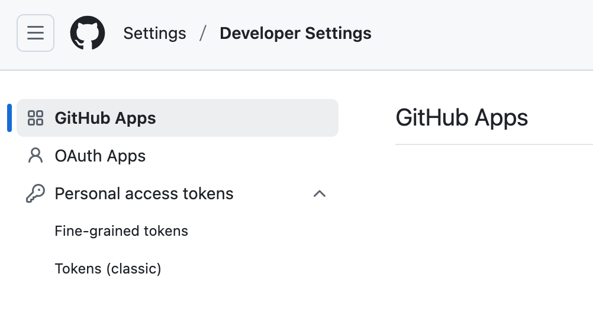
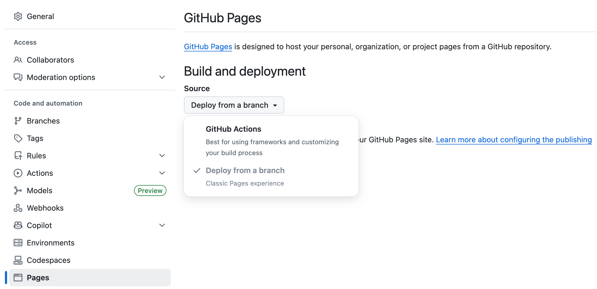
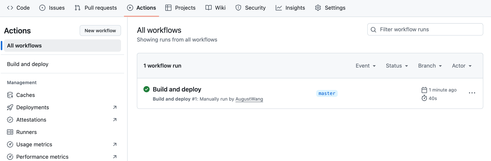
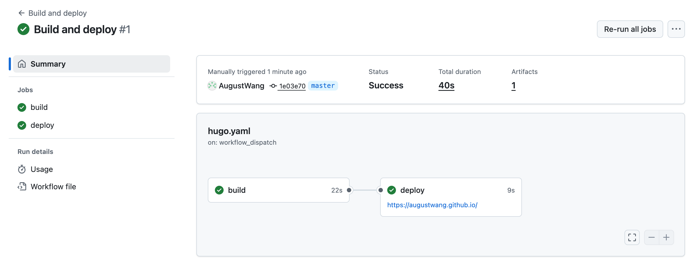
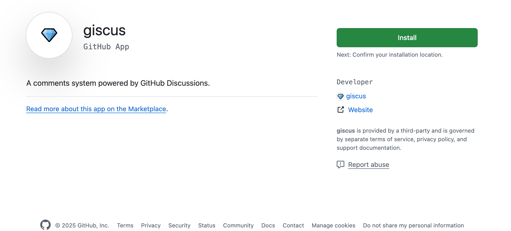
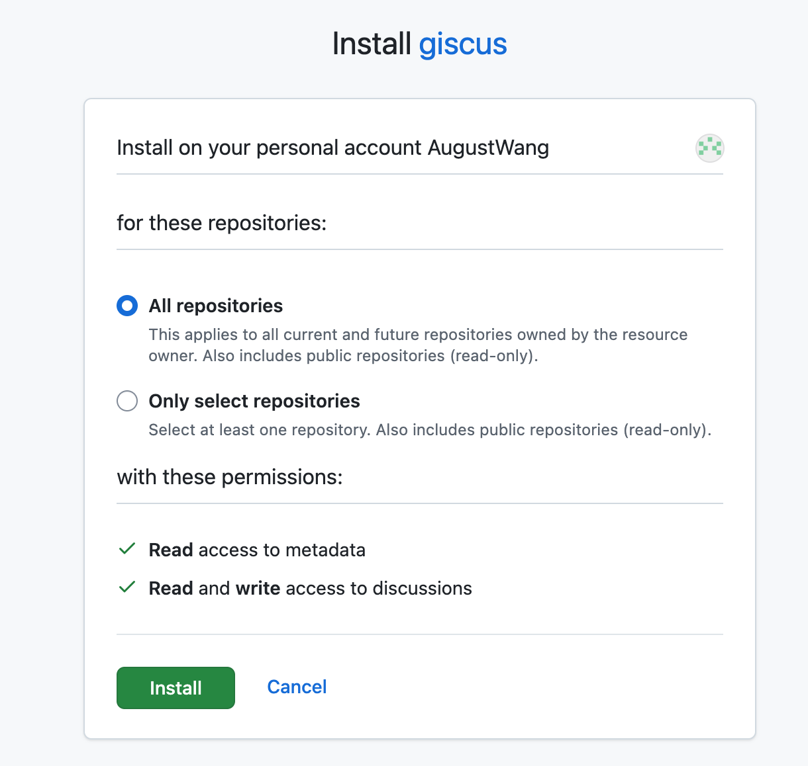
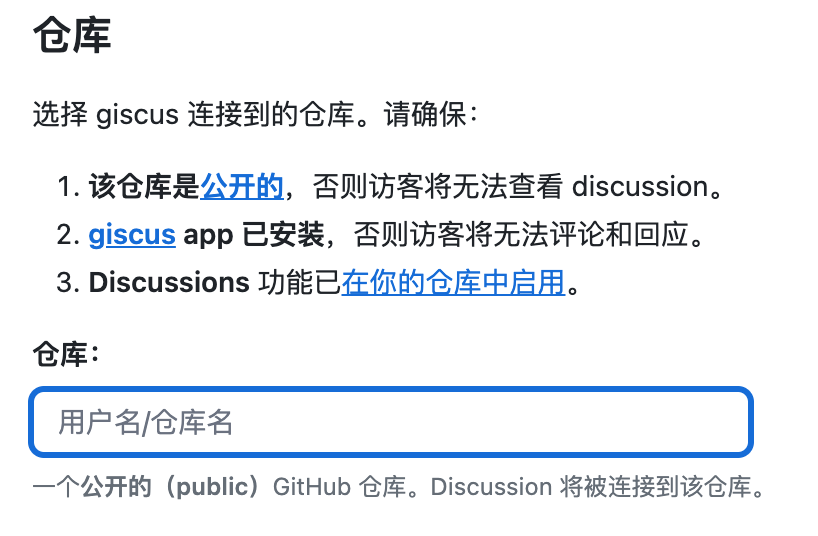
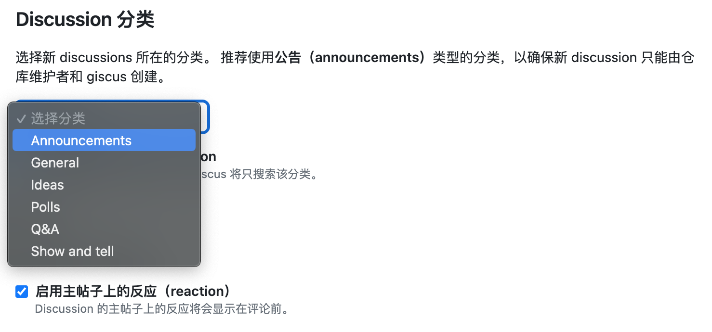
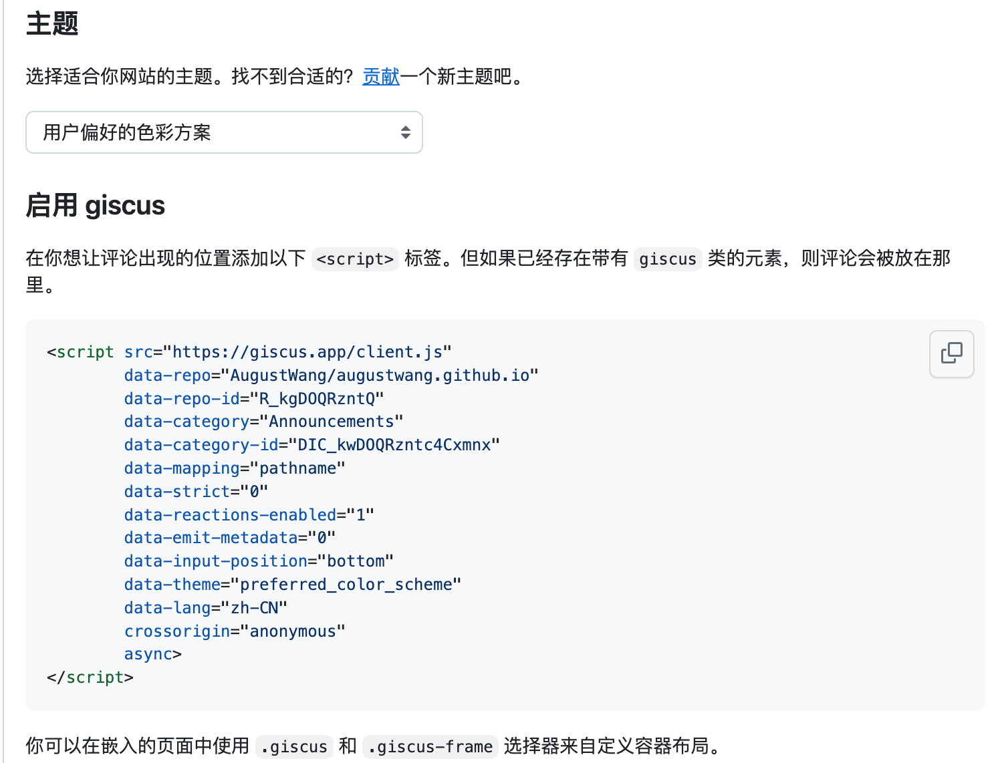

这篇文章主要记录使用 Hogo - **LoveIt** 主题搭建这个网站的过程.

<!--more-->

## 1 准备

[了解 Hugo - **LoveIt** 主题的全部内容和背后的核心概念.](https://hugoloveit.com/zh-cn/theme-documentation-basics/)

## 2 安装

安装Hogo和LoveIt主题的步骤，以及安装过程中可能遇到的问题。

如果根本不了解 Hugo, 建议按照此 [快速入门文档](https://gohugo.io/getting-started/quick-start/) 进一步了解它。

### 2.1 安装Hogo

LoveIt 主题 **0.3.x版本** 依赖Hogo 0.128.0及以上版本，
所以要选择安装对版本，否则运行主题时会报错。



| 分支或版本 | 支持的 Hugo 版本 |
|:---- |:----:|
| master(不稳定) | ≥ 0.128.0 |
| **0.3.X(推荐)** | 0.128.0 - 0.143.1 |
| 0.2.X(过时) | 0.68.0 - 0.127.0 |



[在Mac系统下安装或升级Hogo](https://gohugo.io/installation/macos/)
```bash
brew upgrade hugo

# 查看版本
hugo version
hugo v0.125.5+extended darwin/amd64 BuildDate=2024-05-01T15:22:11Z VendorInfo=brew
```
升级后发现并不是最新版本。

这个时候可以选择源码编译的方式安装：
```bash
go install github.com/gohugoio/hugo@v0.143.1
```

安装后查看版本：
```bash
$GOPATH/bin/hugo version
hugo v0.143.1 darwin/amd64 BuildDate=unknown
```

### 2.2 创建项目

Hugo 提供了一个 `new` 命令来创建一个新的网站:

```bash
hugo new site my_website
cd my_website
```
更多命令行操作[Hugo CLI](https://gohugo.io/commands/hugo/)

创建后的目录结构
```bash
ls my_websit
archetypes assets     content    data       hugo.toml  i18n       layouts    static     themes
```


### 2.3 安装主题

**LoveIt** 主题的仓库是: [https://github.com/dillonzq/LoveIt](https://github.com/dillonzq/LoveIt).


直接把这个主题克隆到 `themes` 目录:

```bash
git clone https://github.com/dillonzq/LoveIt.git themes/LoveIt
```

或者, 初始化你的项目目录为 git 仓库, 并且把主题仓库作为你的网站目录的子模块:

```bash
git init
git submodule add https://github.com/dillonzq/LoveIt.git themes/LoveIt
```

如果不初始化项目目录为 git 仓库，会报如下错误：
```
ERROR Failed to read Git log: fatal: not a git repository (or any of the parent directories): .git
```

初始化后，要创建一个提交，否则会启动失败，提示错误信息如下：
```
ERROR Failed to read Git log: fatal: your current branch 'master' does not have any commits yet
```

### 2.4 创建第一篇文章

以下是创建第一篇文章的方法:

```bash
hugo new posts/first_post.md
```

通过添加一些示例内容并替换文件开头的标题, 你可以随意编辑文章.


默认情况下, 所有文章和页面均作为草稿创建. 如果想要渲染这些页面, 请从元数据中删除属性 `draft: true`, 设置属性 `draft: false` 或者为 `hugo` 命令添加 `-D`/`--buildDrafts` 参数.


### 2.5 在本地启动网站

使用以下命令启动网站:

```bash
$GOPATH/bin/hugo serve
```

去查看 `http://localhost:1313`.


## 3 配置

[Hugo 配置介绍](https://gohugo.io/configuration/introduction/)

### 3.1 网站主题配置

**LoveIt** 主题提供了一个示例: [exampleSite](https://github.com/dillonzq/LoveIt/tree/master/exampleSite)

为了方便看到最终效果，可以直接将这个示例下的所有文件覆盖当前项目目录。

```bash
cp -rf themes/LoveIt/exampleSite .
```

网站配置文件参数详细说明 [hugo.toml](https://hugoloveit.com/zh-cn/theme-documentation-basics/#site-configuration)

直接运行项目查看效果。

## 4 网站部署

部署有多种方式，可以自有服务器部署，也可以选择GitHub Pages，

下面主要介绍两种GitHub Pages的部署方式：

- 一种是使用 GitHub Actions 部署，可以绑定自定义域名

    详细操作步骤：[Host your site on GitHub Pages.](https://gohugo.io/host-and-deploy/host-on-github-pages/)

- 另一种就是静态文件部署

### 4.1 创建 GitHub 仓库

1. 创建一个GitHub仓库，仓库名：username.github.io

将 username 替换为自己的 GitHub 用户名。这个仓库将直接托管这个网站源码和生成的静态文件。

这样后续就可以直接通过：https://username.github.io 来访问网站。

2. 使用 github personal access tokens 来访问仓库


选择 Personal access tokens (classic)，并勾选全部或想要的权限。

3. 创建后提交网站源码
```bash
git remote add origin https://github.com/username/username.github.io.git
git push -u origin master
```

如果使用token
```bash
git remote add origin https://TOKEN@github.com/username/username.github.io.git
git push -u origin master
```
将 `TOKEN` 替换为上面生成的token

### 4.2 静态网站部署到GitHub Pages

1. 直接使用静态文件部署, 本地运行

```bash
hugo server -D
```

运行后，会在项目目录中生成一个 `public` 目录文件，这里面是Hugo生成的整个静态网站。


2. 生成 public 静态资源页面

```bash
hugo --buildDrafts --theme=LoveIt --baseUrl https://username.github.io --config hugo.toml -d public
```

直接将 `public` 目录上传到 `username.github.io` 仓库，这样就可以直接访问网站了。

### 4.3 GitHub Actions 部署

1. 打开仓库 `username.github.io` Settings - Pages，将 Source 改为 GitHub Actions, 如下：



2. 在网站配置 hugo.toml 中添加 [cacheDir](https://gohugo.io/configuration/all/#cachedir) 配置，如下所示：
```toml
[caches]
  [caches.images]
      dir = ':cacheDir/images'
```

3. 在名为 .github/workflows 的目录中创建一个名为 hugo.yaml 的文件

```bash
mkdir -p .github/workflows
touch .github/workflows/hugo.yaml
```

4. 复制以下 YAML 代码并粘贴到您创建的文件中。

请打开下面的代码块查看完整的示例配置 :(far fa-hand-point-down fa-fw)::
```toml
name: Build and deploy
on:
  push:
    branches:
      - main
  workflow_dispatch:
permissions:
  contents: read
  pages: write
  id-token: write
concurrency:
  group: pages
  cancel-in-progress: false
defaults:
  run:
    shell: bash
jobs:
  build:
    runs-on: ubuntu-latest
    env:
      DART_SASS_VERSION: 1.93.2
      GO_VERSION: 1.25.3
      HUGO_VERSION: 0.152.2
      NODE_VERSION: 22.20.0
      TZ: Europe/Oslo
    steps:
      - name: Checkout
        uses: actions/checkout@v5
        with:
          submodules: recursive
          fetch-depth: 0
      - name: Setup Go
        uses: actions/setup-go@v5
        with:
          go-version: ${{ env.GO_VERSION }}
          cache: false
      - name: Setup Node.js
        uses: actions/setup-node@v4
        with:
          node-version: ${{ env.NODE_VERSION }}
      - name: Setup Pages
        id: pages
        uses: actions/configure-pages@v5
      - name: Create directory for user-specific executable files
        run: |
          mkdir -p "${HOME}/.local"
      - name: Install Dart Sass
        run: |
          curl -sLJO "https://github.com/sass/dart-sass/releases/download/${DART_SASS_VERSION}/dart-sass-${DART_SASS_VERSION}-linux-x64.tar.gz"
          tar -C "${HOME}/.local" -xf "dart-sass-${DART_SASS_VERSION}-linux-x64.tar.gz"
          rm "dart-sass-${DART_SASS_VERSION}-linux-x64.tar.gz"
          echo "${HOME}/.local/dart-sass" >> "${GITHUB_PATH}"
      - name: Install Hugo
        run: |
          curl -sLJO "https://github.com/gohugoio/hugo/releases/download/v${HUGO_VERSION}/hugo_extended_${HUGO_VERSION}_linux-amd64.tar.gz"
          mkdir "${HOME}/.local/hugo"
          tar -C "${HOME}/.local/hugo" -xf "hugo_extended_${HUGO_VERSION}_linux-amd64.tar.gz"
          rm "hugo_extended_${HUGO_VERSION}_linux-amd64.tar.gz"
          echo "${HOME}/.local/hugo" >> "${GITHUB_PATH}"
      - name: Verify installations
        run: |
          echo "Dart Sass: $(sass --version)"
          echo "Go: $(go version)"
          echo "Hugo: $(hugo version)"
          echo "Node.js: $(node --version)"
      - name: Install Node.js dependencies
        run: |
          [[ -f package-lock.json || -f npm-shrinkwrap.json ]] && npm ci || true
      - name: Configure Git
        run: |
          git config core.quotepath false
      - name: Cache restore
        id: cache-restore
        uses: actions/cache/restore@v4
        with:
          path: ${{ runner.temp }}/hugo_cache
          key: hugo-${{ github.run_id }}
          restore-keys:
            hugo-
      - name: Build the site
        run: |
          hugo \
            --gc \
            --minify \
            --baseURL "${{ steps.pages.outputs.base_url }}/" \
            --cacheDir "${{ runner.temp }}/hugo_cache"
      - name: Cache save
        id: cache-save
        uses: actions/cache/save@v4
        with:
          path: ${{ runner.temp }}/hugo_cache
          key: ${{ steps.cache-restore.outputs.cache-primary-key }}
      - name: Upload artifact
        uses: actions/upload-pages-artifact@v3
        with:
          path: ./public
  deploy:
    environment:
      name: github-pages
      url: ${{ steps.deployment.outputs.page_url }}
    runs-on: ubuntu-latest
    needs: build
    steps:
      - name: Deploy to GitHub Pages
        id: deployment
        uses: actions/deploy-pages@v4
```

5. 将更改提交到本地 Git 仓库，然后推送到 GitHub 仓库。

将主题作为项目子模块提交
```bash
git submodule add https://github.com/dillonzq/LoveIt.git themes/LoveIt
```

获取完成后，可以选择子模块对应的tag,比如下面选择 tag:v0.3.0 版本
```bash
cd themes/LoveIt
git checkout v0.3.0
```

查看状态
```bash
git submodule status
f59fb4ecc2ce6c95e0b3395e3d3da9637d5581cd themes/LoveIt (v0.2.11-169-gf59fb4ec)
```

6. 从 GitHub 主菜单中选择 Actions 。将看到类似这样的界面：

选择 run workflow


运行完成后


点击可以看到结果



## 5 评论系统

[giscus](https://giscus.app/zh-CN) 是由 [GitHub Discussions](https://docs.github.com/en/discussions) 驱动的评论系统。

### 5.1 GitHub 开启 Discussions 功能

在自己的 github pages 项目下开启 Discussions 功能。

详细操作流程：[Enabling GitHub Discussions on your repository](https://docs.github.com/en/discussions/quickstart#enabling-github-discussions-on-your-repository)

### 5.2 安装 giscus app

打开 [giscus apps](https://github.com/apps/giscus), 点击安装。



再次授权安装即可。



### 5.3 将 Discussion 连接到项目仓库

1. 打开 [giscus.app/zh-CN](https://giscus.app/zh-CN)，



输入自己网站仓库名称就可以安装

2. 然后在下面的 Discussion 分类 中选择使用公告（announcements）类型的分类



3. 最后 在 **启用 giscus** 可以看到生成的 `<script>` 标签代码


将代码中的参数复制到 hugo.toml 配置中即可

配置示例如下：
```toml
      # giscus comment config (https://giscus.app/)
      # giscus comment 评论系统设置 (https://giscus.app/zh-CN)
      [params.page.comment.giscus]
        # You can refer to the official documentation of giscus to use the following configuration.
        # 你可以参考官方文档来使用下列配置
        enable = true
        repo = "AugustWang/augustwang.github.io"
        repoId = "R_kgDOQRzntQ"
        category = "Announcements"
        categoryId = "DIC_kwDOQRzntc4Cxmnx"
        # automatically adapt the current theme i18n configuration when empty
        # 为空时自动适配当前主题 i18n 配置
        lang = "zh-CN"
        mapping = "pathname"
        reactionsEnabled = "1"
        emitMetadata = "0"
        inputPosition = "bottom"
        lazyLoading = false
        lightTheme = "light"
        darkTheme = "dark"

```
提交配置文件，后续就可以在文章中评论了。


